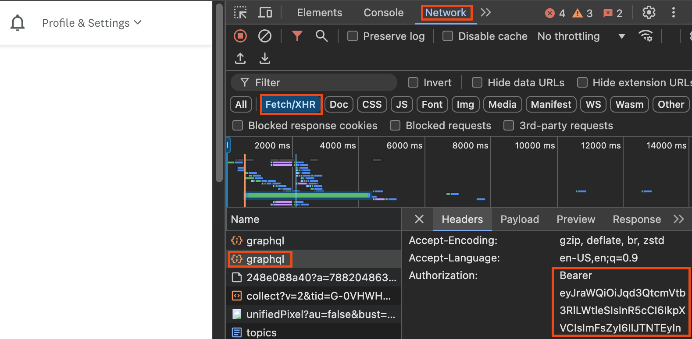

# Extract transaction data from Credit Karma with Python
A simple app to extract transaction data from Credit Karma so it can be imported to other tools


### Setup and usage
1. To begin, you'll need an auth token to login programmatically to Credit Karma:
    - Login to Credit Karma using Chrome and with the developer tools open
    - Navigate to the "Network" tab
    - Filter for "Fetch/XHR"
    - Select "graphql"
    - Select the "Headers" tab and scroll until you find the "Authorization" data
    - You should see the word "Bearer" and the token will be just underneath it

        

2. Create a `.env` file in the root directory of the app and add the token to it like this:
    ```
    # .env
    token = '<insert_bearer_token_here>'
    ```
3. From the CLI, run `python ck-extract.py` and the script will download your transactions history to 'transactions.csv'

### Sources
Credit for this idea goes partially to [@mmrobins](https://github.com/mmrobins), as he built a similar application in Ruby from which I've adapted some of this code. You can find that work here: https://github.com/mmrobins/creditkarma_export_transactions